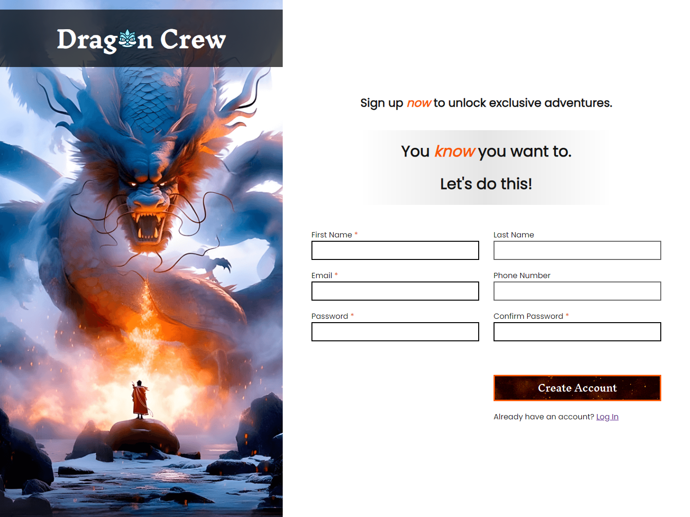

# Odin-Sign-up-Form

[Live link is here.](https://x6nenko.github.io/Odin-Sign-up-Form/)

## Project tasks.
- [x] Recreate the layout.
- [x] Make it look nice at all desktop resolutions.

### Extra project tasks:
- [x] Check that the password fields match each other.
    - [x] Display a tip if password fields did not match.

## Extra features. They are not required by a project. That's my list of optional ideas and tasks to make it better.

### Extra features that were implemented:
- [x] Better UI and UX.
    - [x] Used pseudo-elements and other stuff that wouldn't be required by a suggested design.
    - [x] Used various attributes to help the user type the correct data into the fields (for each field): autocomplete, pattern, etc.
- [x] Whenever the password field is focused, show tips on password requirements.
    - [x] Change the tips dynamically: it is displayed visually what requirements are met and what are not.
- [x] Allow submitting the form only if the password fields match each other.
- [x] Optimised the lighthouse to show 4x 100.

### Extra features and tasks to implement:
- [ ] Refactor the code. Make it more clean. DRY.
- [ ] Add JS form validation.

## What I've learned.
- Accessibility features: HTML form attributes, showing nice tips (for example, showing just a red message that passwords do not match might not be enough, so I also added an icon).
- Practised the usage of pseudo-elements and some CSS stuff, such as "calc".